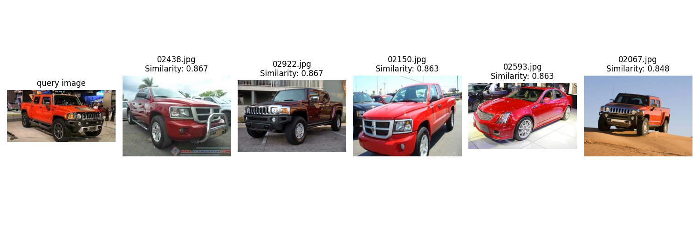

# Image Similarity
Utilize cosine similarity computations applied to feature vectors derived from the ResNet50 model to extract analogous images from the designated dataset.



## Setup
### Install requirements
<!-- `pip install pre-commit==2.13.0` -->
`pip install -r requirements.txt`
* Dev only

`pre-commit install`

### Download dataset
* Download the dataset and extract it to `dataset/` directory.

## Usage
### Generate feature vector
```
usage: main.py generate [-h] --dataset-path DATASET_PATH --output-dir OUTPUT_DIR

options:
  -h, --help            show this help message and exit
  --dataset-path DATASET_PATH, -dp DATASET_PATH
                        Dataset path
  --output-dir OUTPUT_DIR, -od OUTPUT_DIR
                        Feature vector output dir
```

* Example
```
python main.py generate --dataset-path dataset/ --output-dir .
```

### Search similar image
```
usage: main.py search [-h] --input-image INPUT_IMAGE --dataset-path DATASET_PATH --vectors-path VECTORS_PATH

options:
  -h, --help            show this help message and exit
  --input-image INPUT_IMAGE, -im INPUT_IMAGE
                        Input image
  --dataset-path DATASET_PATH, -dp DATASET_PATH
                        Dataset path
  --vectors-path VECTORS_PATH, -vp VECTORS_PATH
                        Vectors file path
```

* Example
```
python main.py search \
    --input-image images/car.jpg \
    --dataset-path dataset/ \
    --vectors-path ./vectorized_dataset.npy
```

### Run tests
```
pytest
```
